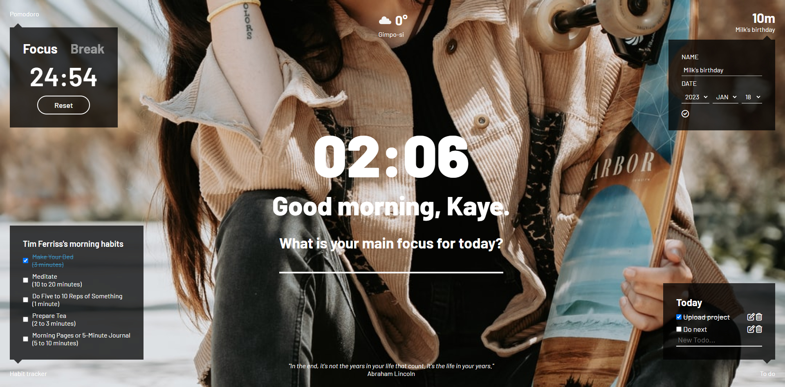

# Momentum

[바닐라 JS 챌린지](https://nomadcoders.co/c/vanillajs-challenge/lobby)

## Table of contents

- [Overview](#overview)
  - [The Project](#the-project)
  - [Screenshot](#screenshot)
- [My process](#my-process)
  - [Built with](#built-with)
- [Author](#author)

## Overview

### The Project

Users should be able to:
   
- Saves name in local storage
- background images (random) using API

- Pomodoro system
- Count down (Add, Edit, Delete)
- Weather and location using API
- Habit Tracker
- Quotes (random)
- To do list (Add, Edit, Delete)

- Time and greeting text
- main focus to do

### Screenshot

## My process

**2022.03.18**
   
Figma로 계획 했다. momentum의 의도를 반영하기 위해 최대한 깔끔한 구성을 원했다. 또한 기능을 많이 넣을 시간이 없어서 간단하게 넣어봤다. 오늘은 디자인에 큰 신경을 쓸 예정. 일단 첫 화면과 메인 화면 대강 위치랑 디자인을 잡았다.

**2022.03.20**
    
4일이라길래.. 월요일 풀로 시간 주나...? 했는데 월요일 오전 6시까지라서 급하게 기능 몇 가지 단축시켰다... ㅋㅋㅋㅋㅋ 뭐 그래도 넣을 건 많이 넣었다. local storage 이용하는 게 조금 까다로웠다... 귀찮달까...? 일단 대충 완성은 했는데 코드 정리는 씻고 나서 해야겠다 굳.

흐미... 시간 너무 촉박하네.. 코드 정리는 시간 밖에 못했다 ㅋㅋ 약간 이름도 맘에 안들고 ㅎㅎ... 좀.. 별로긴 하다. 낼 본업 들어가야 해서... 나중에 시간 나면 틈틈히 수정해줘야 겠다. 업글도 하고... 넣고 싶은 기능 많았는데... 쭈끌...

### Built with

- HTML
- CSS
  - SCSS
- JS
- API

## Author

- GitHub - [@2001Kaye](https://github.com/jhan117)